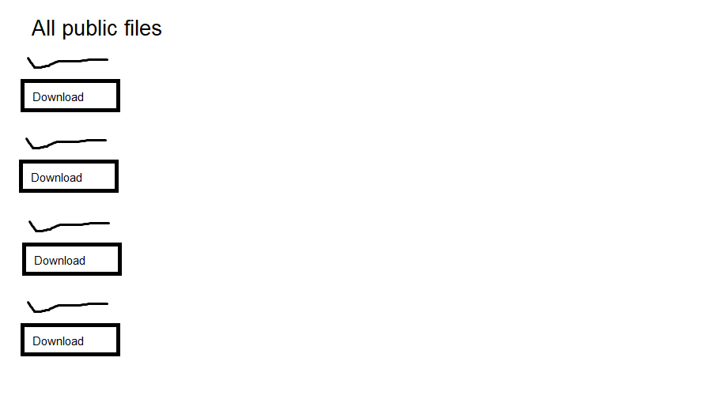
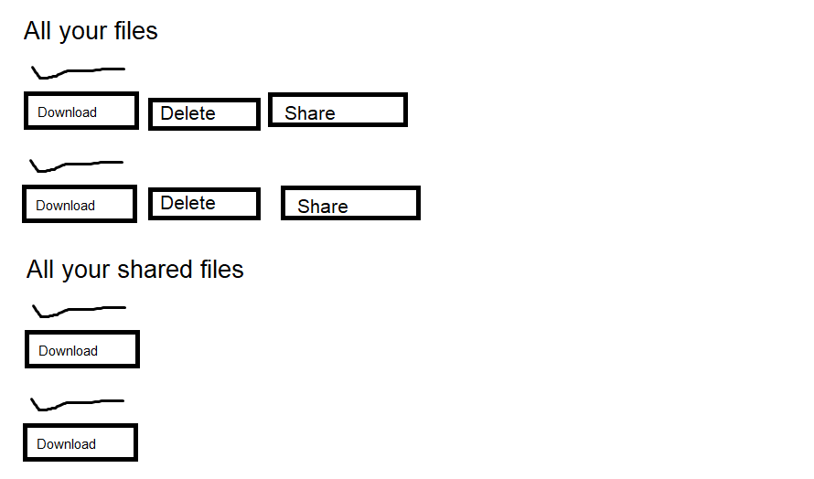

# Projektplan

## 1. Projektbeskrivning (Beskriv vad sidan ska kunna göra)
Man ska kunna ladda upp sina filer och dela dem med andra användare, man ska även kunna göra filerna public för att alla ska kunna se och ladda ner filerna. Filerna ska även kunna gå att dela med en unik url exempel www.example.com/files/xxx-xxx-xxx
## 2. Vyer (visa bildskisser på dina sidor)
#Registeringssidan

#Användarens homepage

#Visa alla filer som är public

## 3. Databas med ER-diagram (Bild)

## 4. Arkitektur (Beskriv filer och mappar - vad gör/inehåller de?)
Mappar:
filesystem, denna har alla filer, alltså själva datan. Strukturen fungerar så att i mappen finns undermappar som är numrerade med user_id av användaren som filerna tillhör. I denna mappen ligger sedan själva filerna. På detta sätt kan man lätt använda databasen för att se user_id på användaren och lätt komma åt denna användares filer. 

files mappen innehåller alla slim filer som har med filerna att göra. Exempelvis deras index.slim.

Filer:
app.rb, denna är controller i MVC, den har alla routes och har hand om sessions etc
model.rb, denna är model i MVC, den kommunicerar med databasen och filsystemet, den har även vissa helperfunktioner
