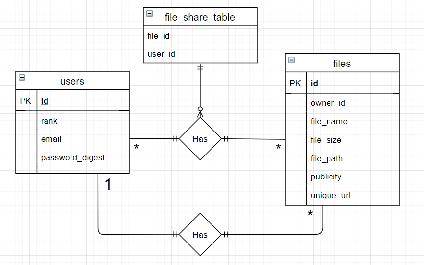

# Projektplan

## 1. Projektbeskrivning (Beskriv vad sidan ska kunna göra)
Man ska kunna ladda upp sina filer och dela dem med andra användare, man ska även kunna göra filerna public för att alla ska kunna se och ladda ner filerna. Filerna ska även kunna gå att dela med en unik url exempel www.example.com/files/xxx-xxx-xxx
## 2. Vyer (visa bildskisser på dina sidor)
## 3. Databas med ER-diagram (Bild)

## 4. Arkitektur (Beskriv filer och mappar - vad gör/inehåller de?)
Mappar:
filesystem, denna har alla filer
files, denna mapp inehåller alla slim filer som har med filerna att göra
Filer:
app.rb, denna är controller i MVC
model.rb, denna är model i MVC
